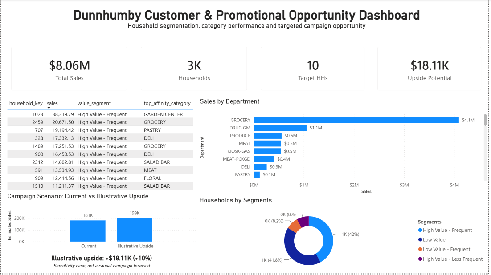
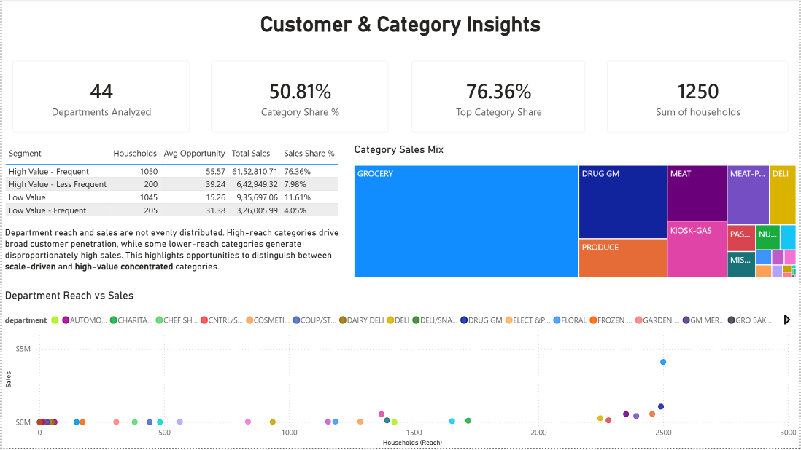
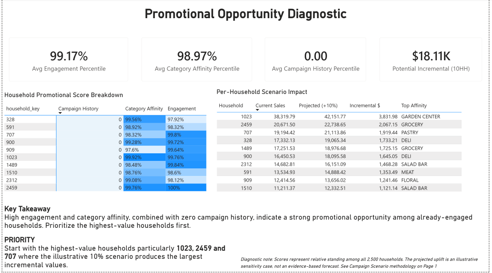

# Dunnhumby Customer & Promotional Opportunity Analysis

Customer segmentation, category performance analysis, and promotional opportunity diagnostics built on the dunnhumby Complete Journey dataset — using Python, SQL, AWS, and Power BI, with every core figure cross-validated across three independent tools.

## Business Question

Which product categories and customer segments should receive greater promotional investment, and where should promotional strategy be optimized?

## Key Finding

Ten households combine near-ceiling engagement (99.17th percentile avg) and category affinity (98.97th percentile avg) with **zero recorded campaign history** — a specific, evidence-backed promotional opportunity identified directly from behavioral scoring, not a general segment guess.

Targeting them represents an estimated **$18.1K in potential incremental sales** under a clearly-labeled illustrative sensitivity case (not a causal forecast — see Limitations below).

## Approach

```text
Pandas / EDA + Scoring & Segmentation
        ↓
PostgreSQL — analytical layer, validated against pandas
        ↓
AWS S3 + Athena — third-layer validation on raw cloud data
        ↓
Campaign Scenario — sensitivity analysis on the untapped-household finding
        ↓
Power BI Dashboard — 3 pages
        ↓
Recommendation Memo
```

Each stage was deliberately kept in scope: the notebooks build and validate the logic, SQL translates and re-confirms it, AWS proves the pipeline works on raw cloud data, and the dashboard/memo communicate the finding — no stage re-derives work already done in an earlier one.

## Repository Structure

```text
├── Notebooks/
│   ├── 01_data_audit.ipynb
│   │   # Schema, quality checks, referential integrity
│   ├── 02_analytical_eda_v2_natural.ipynb
│   │   # EDA, business scoring, segmentation
│   ├── 03_postgresql_analysis.ipynb
│   │   # SQL translation + pandas/SQL validation
│   └── 04_campaign_scenario.ipynb
│       # Campaign scenario sensitivity analysis
├── sql/
│   └── # Standalone PostgreSQL analytical queries
├── aws/
│   └── # S3/Athena setup and validation queries
├── PowerBI/
│   └── # 3-page dashboard (.pbix)
├── memo/
│   └── # Recommendation memo
└── data/Derived/
    └── # Exported summary tables feeding Power BI
```

## Methodology

### 1. Data Audit

Inventoried the dunnhumby Complete Journey dataset:

* 2,500 households
* 2.6M transactions
* 102 weeks
* $8.06M total sales

Checked schema, duplicates, referential integrity, and time coverage before any analysis began.

### 2. EDA & Business Scoring

Built category, campaign, and demographic analysis, then a household-level **Promotional Opportunity Score**:

* Engagement — 35%
* Category Affinity — 30%
* Campaign Responsiveness — 35%

Two scoring bugs were found and fixed during development:

1. A zero-inflation issue that tied all non-responding households to an artificial 41st percentile instead of the bottom.
2. A department-size bias that allowed large categories such as Grocery to dominate every household's "top affinity," regardless of actual specialization.

Both fixes are documented in-notebook with before/after evidence.

### 3. PostgreSQL Validation

Translated the full scoring pipeline into SQL using window functions, reproducing every fix from the pandas layer.

Cross-validated:

* Total sales
* Department performance
* Household metrics
* Campaign figures

All matched pandas to the cent.

### 4. AWS S3 + Athena

Landed raw CSVs in S3 and queried them through Athena.

Independently re-confirmed total sales and row counts against both prior layers, providing a third, fully independent validation of the same core numbers.

### 5. Campaign Scenario

Tested whether campaign exposure is associated with higher spending, stratified by household value tier to control for baseline differences.

The untapped households' own value tier showed **no positive historical gap**, so the resulting +10% scenario is explicitly labeled illustrative, not evidence-based.

### 6. Power BI Dashboard

Built a three-page dashboard:

1. **Executive Overview**
2. **Customer & Category Insights**
3. **Promotional Opportunity Diagnostic**

The diagnostic page uses a heatmap-style matrix showing all 10 households' three score components side by side.

## Key Findings

* **Category concentration:** GROCERY drives **50.81% of total sales**.
* Category reach and category value are not the same — some categories generate high sales from few households, while others drive broad penetration at lower value.
* **Segment concentration:** High Value – Frequent households represent **42.0% of the base** but generate **76.36% of total sales ($6.15M)**.
* **Untapped household opportunity:** 10 households combine extremely high engagement and category affinity with zero recorded campaign history, creating the project's central actionable finding.

## Validation

Every core figure is cross-checked across **pandas, PostgreSQL, and AWS Athena**.

Validated metrics include:

* Total sales — **$8,057,463.08**
* Household count — **2,500**
* Segment sizes
* Untapped-household scores

Results match across all three analytical layers.

Validation logic and outputs are documented directly in the notebooks, particularly `03_postgresql_analysis.ipynb`, section 3.5.

## Limitations & Assumptions

* The campaign scenario's **+10% uplift is an illustrative sensitivity case**, not a causal estimate. The untapped households' own value tier showed no positive campaign-exposure gap in the historical data.
* The exposed-vs-non-exposed comparison is a **stratified observational comparison**, not a randomized experiment.
* Demographic data covers only **32% of households** and is therefore treated as supplementary context rather than primary segmentation.
* The dataset's `quantity` field mixes item counts and weight-based units depending on product type. Category-level quantity comparisons are therefore directional, not literal unit counts.

## Tech Stack

```text
Python
├── pandas
└── psycopg2

PostgreSQL
SQL
├── Window Functions
└── CTEs

AWS
├── S3
└── Athena

Power BI
```

## Dashboard Preview

### Executive Overview


### Customer & Category Insights


### Promotional Opportunity Diagnostic

